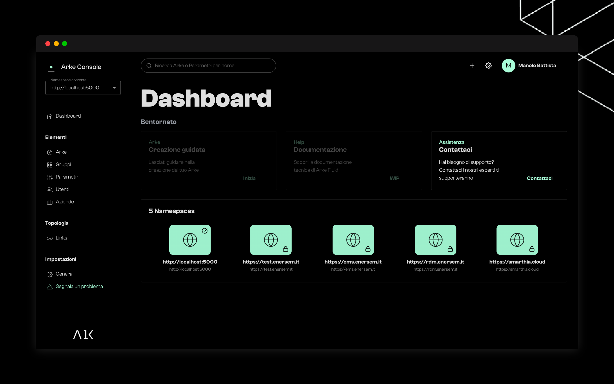

## Creare un Arke App

### Docker
L'immagine del backend e del DB Postgress é disponibile nel [Docker Hub](https://hub.docker.com/r/arke/postgres) 
con il nome arke/postgres. Scaricarla e lanciarla da Docker per avere il backend e il DB pronto.
Di default questo lavora su `localhost:5000`.

### Arke Console
Puoi accedere all'Arke Console da [arkehub.com/console](https://arkehub.com/console) o scaricare 
l'[applicazione client](https://arkehub.com/download/client).

Per iniziare a lavorare l'Arke Console deve puntare all'indirizzo del progetto backend locale. Lanciamo la console e
creiamo un nuovo progetto puntando `localhost:5000`.




### Arke JS
Arke é un backend che lavora con lo standard REST API, questo lo rende compatibile con differenti tools e frameworks.

L'Arke JS é il client Javascript che consente di dialogare facilmente con Arke.

#### NPM

L'Arke JS package é disponibile in npm. Per installare l'ultima versione stabile, lanciare il comando:

```bash
npm install @arke/js
```

#### CDN

Arke JS offre la build UMD che può essere accessibile direttamente usando il tag `<script>`. Raccomandiamo di utilizzare 
una versione specifica per evitare eccezzioni inaspettate nelle nuove versioni.

```html
<script src="https://cdn.jsdelivr.net/npm/arkejs@1.0.0/umd/arke.production.js"/>
```