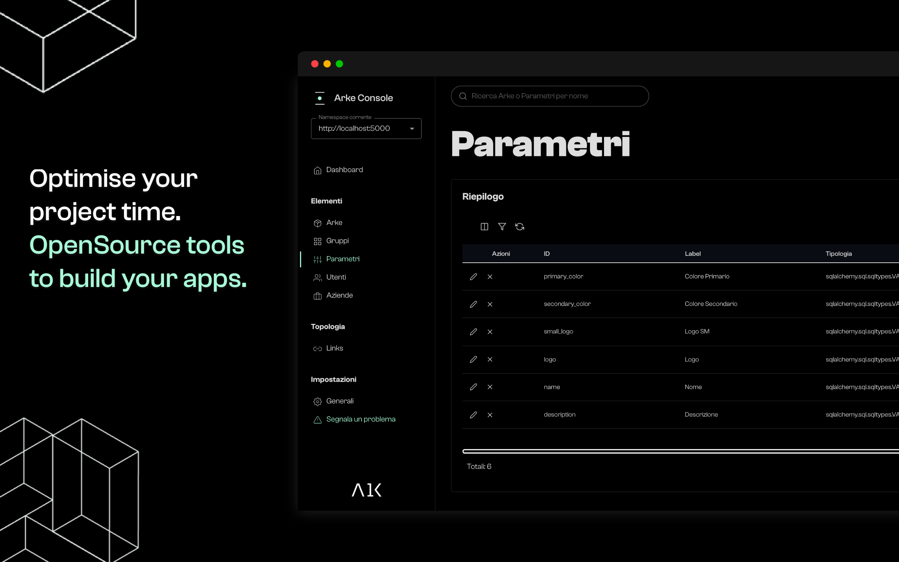

É una raccolta di strumenti che aiuta gli sviluppatori a creare progetti più rapidamente nascondendo e gestendo per te 
automaticamente il “dietro le quinte” del lavoro.

Creando un progetto Arke ti fornirá un Database, le API autogenerate per interagire con il database e una console di 
supervisione per la gestione del tutto.

Ad oggi le fondamenta per la creazione di una qualsiasi app o servizio richiede un grosso sforzo e un ampia fase di 
progettazione, Arke permette di risparmiare ore e energie semplificando questo processo attraverso dei semplici click.

