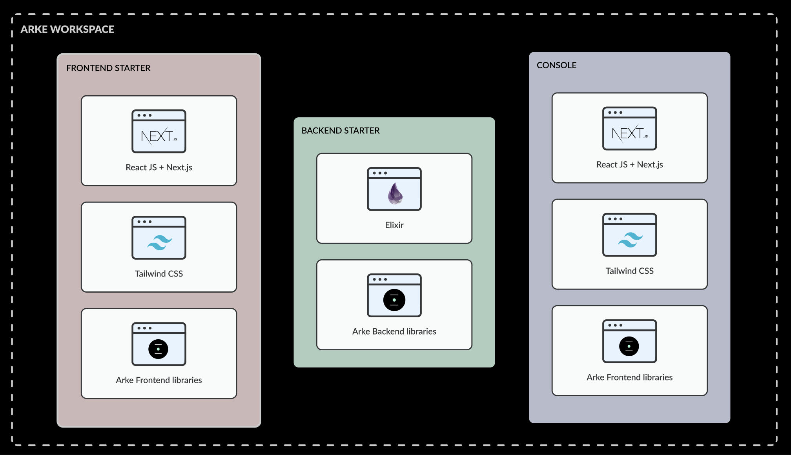
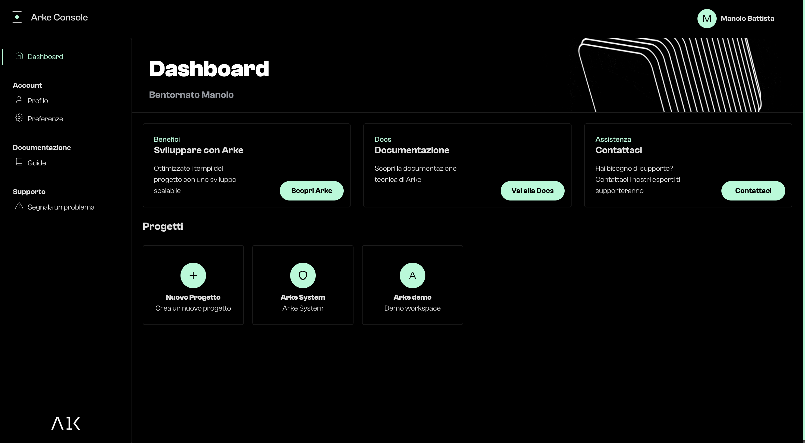

### Architecture

There are three main actors on Arke application:

- Frontend: the starter frontend application based on React and Next.js where you can make your customization
- Backend: the starter backend application, the core of Arke, also in this case you can make any type of customization
- Console: An easily no-code interface to manage your backend 

#### Frontend Starter

The Frontend starter is a boilerplate React/Next.js application.

React is a JavaScript library for building interactive user interfaces.
By user interfaces, we mean the elements that users see and interact with on-screen.

Next.js is a React framework that gives you building blocks to create web applications.
By framework, we mean Next.js handles the tooling and configuration needed for React, and provides additional structure,
features, and optimizations for your application.

Tailwind CSS is a utility-first CSS framework packed with classes hat can be composed to build any design, directly in 
your markup.

Arke provides a set of frontend dedicated libraries:
- [@arkejs/client](https://arkemishub.github.io/clientjs/): a client js to easily connect the backend
- [@arkejs/ui](https://arkemishub.github.io/ui/): UI components library based on Tailwind CSS
- [@arkejs/form](https://arkemishub.github.io/form/): form components to automate form generation process
- [@arkejs/table](https://arkemishub.github.io/table/): table components to generate tables

#### Backend Starter

Elixir is a dynamic, functional language for building scalable and maintainable applications.

Elixir runs on the Erlang VM, known for creating low-latency, distributed, and fault-tolerant systems. These capabilities 
and Elixir tooling allow developers to be productive in several domains, such as web development, embedded software, 
data pipelines, and multimedia processing, across a wide range of industries.

The backend is the set of logic, rules and algorithms used to manage the exchange and processing of information between 
the database and the user interface. This system serves as the "behind-the-scenes" connector and is divided into several
development areas, each with specific functionality.

- Security & permissions: includes the security measures and access permissions that are set to protect the
application's data and resources. Security is concerned with ensuring that the application is protected from external 
threats. Access permissions regulate how users can access the application's data and functionality.

- Persistence: includes the logics that allow each piece of data in the database to be related to a specific element,
which will then be laid out and displayed in the application.

- Logic: includes the functionality and algorithms that determine the actual behavior of elements arranged on the screen.

- Network: includes the communication management services between the server, i.e., the main computer system on which
the application runs, and the outside, i.e., the clients accessing the application through their devices.

#### Console

Arke Console is a simple and intuitive interface to manage arke, parameters and units of your application.

In the next guides we learn how to init this workspace on your local machine
