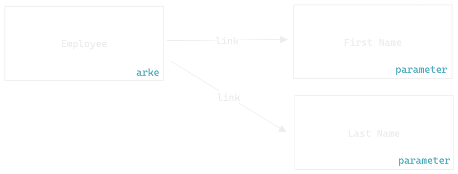

In order to get started with Arke development you need to understand how data should be modeled and how you should think in order to create your structures.

## Arke vs Relational Databases
If you think in a relational database way, when you want to define a new entity you will need to create a new table, and then you will need to define the columns of the table.
Once you have defined the columns you will need to create a new record for each entity that you want to manage.

In Arke in order to define a new entity you will need to create a new **Arke**.
In the same way that you would define the columns of a table, you will need to define the parameters of an Arke, in order to do this you will need to create a new **Parameter** and link it to the **Arke**.
After you have defined the parameters of the Arke you will need to create a new **Unit** for each entity that you want to manage.

Following schema represents how entities should be structured in Arke:

## Recap Table

Below you can find a quick recap table that will help you to understand the differences between Arke and Relational Databases.

| Relational Database | Arke      |
|---------------------|-----------|
| Table               | Arke      |
| Column              | Parameter |
| Record              | Unit      |
| Relation            | Link      |
