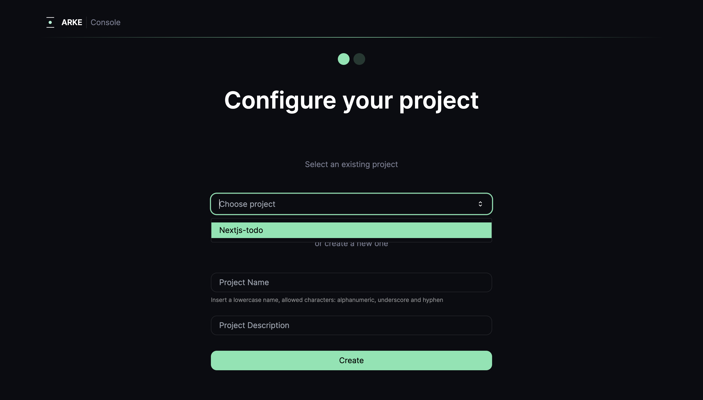
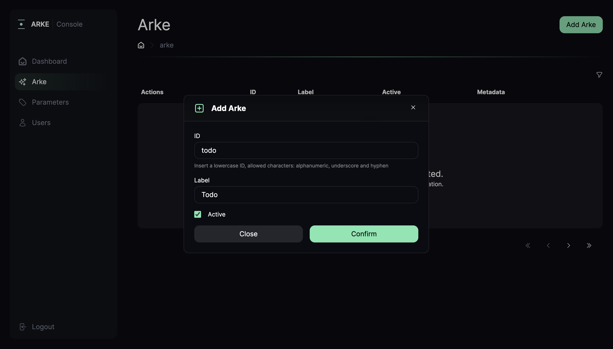
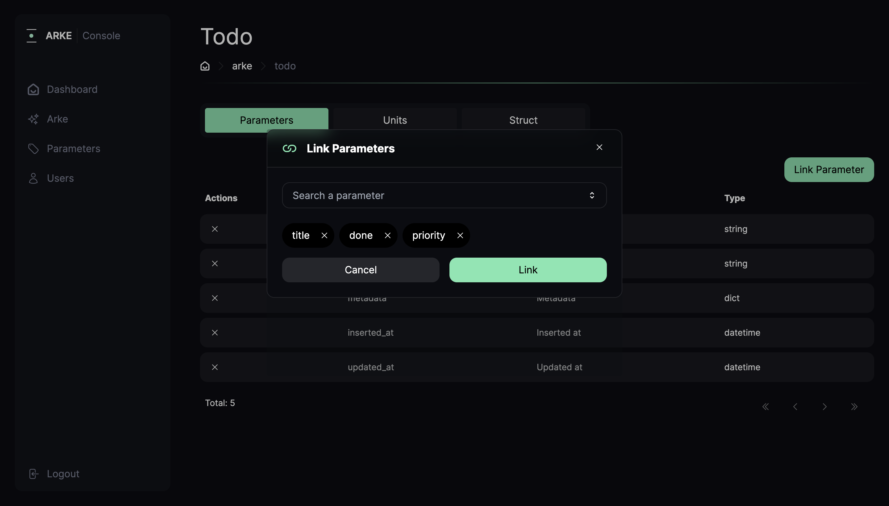

In order to structure your data, you will use the Arke console.

## Log in to the console

Once the console is started, you need to log in. By default, you can use:

```bash
username: admin
password: admin
```

Since you ran `arkectl create-app nextjs-todo` you don't need to create a project.
Just select it from the dropdown of get started page as shown below.



---

## Create your first Arke

Since our goal is to create a todo app we need to create an **Arke** named `Todo`.

* Navigate to [http://localhost:3100/arke](http://localhost:3100/arke)
* Click `Add Arke`
* Fill the form as following



---

## Create parameters

For our todo list, we will create following parameters: `title`, `done` and `priority`.
It's important to understand which type you need for each parameter, in our case title will be a `string`, done will be a `bool` and priority an `enum`.

* Navigate to [http://localhost:3100/parameters](http://localhost:3100/parameters)
* Click `Add Parameter` 
* Create the parameters as shown below.

<video controls width="100%" playsinline>
<source src="/docs/videos/tutorial/create-parameters.mp4" type="video/mp4"/>
</video>

---

## Link parameters
Now that we have the parameters all we have to do is link them to our Todo `Arke`.

* Navigate to [http://localhost:3100/arke/todo](http://localhost:3100/arke/todo#parameters)
* Click on `Parameters` tab
* Click `Link Parameters`
* Link the parameters as shown below



---

## Create a todo

Let's create our first task:
* Navigate to [http://localhost:3100/arke/todo](http://localhost:3100/arke/todo#units)
* Click `Add Todo`
* Fill the form with some data
  
## Recap
Congrats, you created your first `Arke`! 
